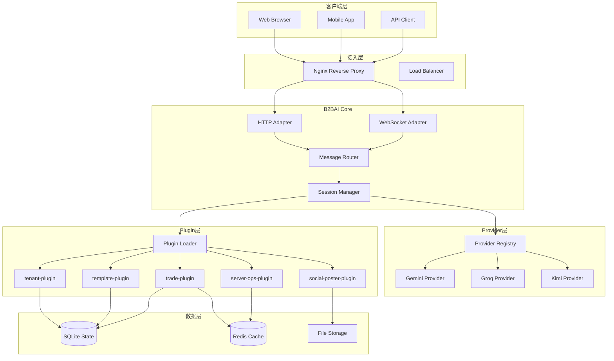
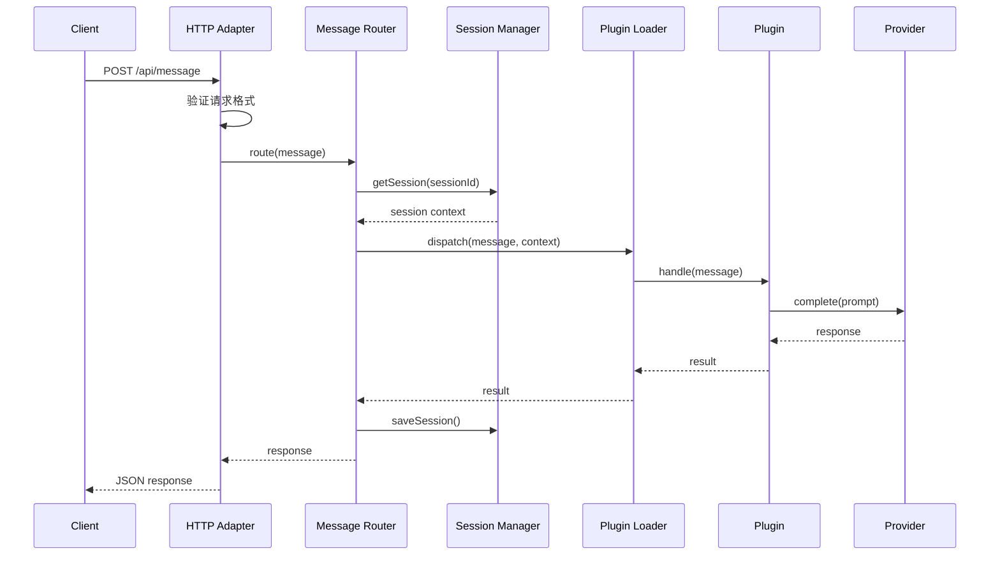
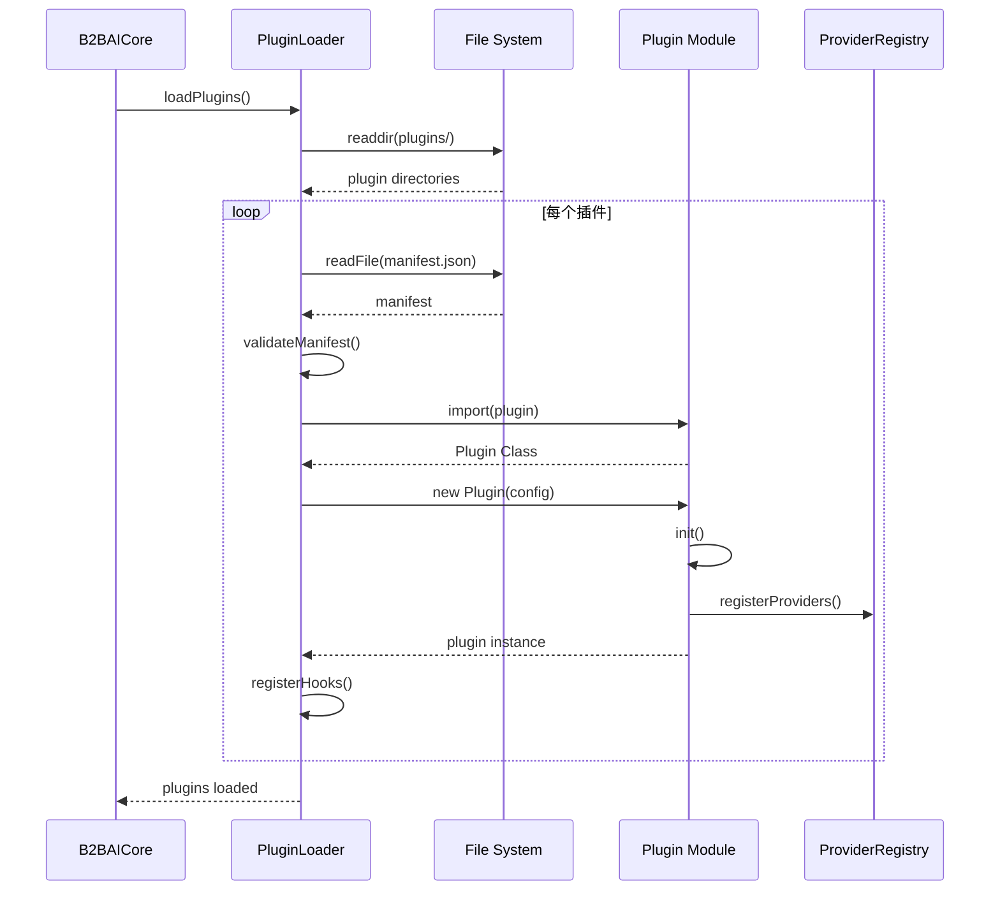

# B2BAI 架构设计文档 (细化版 v1.1)

> 版本: v1.1 | 更新: 2026-03-05 | 细化轮次: 1/3

---

## 一、系统架构图



---

## 二、核心时序图

### 2.1 消息处理流程



### 2.2 插件加载流程



---

## 三、数据模型

### 3.1 会话模型 (Session)

```typescript
interface Session {
  id: string;              // UUID v4
  tenantId: string;        // 租户ID
  channel: 'http' | 'websocket' | 'slack' | 'telegram';
  userId: string;
  context: {
    history: Message[];
    state: Record<string, any>;
    metadata: Record<string, any>;
  };
  createdAt: Date;
  updatedAt: Date;
  ttl: number;             // 过期时间(秒)
}

interface Message {
  id: string;
  role: 'user' | 'assistant' | 'system';
  content: string;
  timestamp: Date;
  provider?: string;       // 使用的LLM provider
  tokens?: {
    input: number;
    output: number;
    total: number;
  };
}
```

### 3.2 插件模型 (Plugin)

```typescript
interface PluginManifest {
  name: string;
  version: string;
  description: string;
  author: string;
  entry: string;           // 入口文件
  config: {
    schema: JSONSchema;    // 配置项JSON Schema
    defaults: Record<string, any>;
  };
  hooks: {
    onInit?: boolean;
    onMessage?: boolean;
    onDestroy?: boolean;
  };
  permissions: string[];   // 所需权限列表
  dependencies: string[];  // 依赖插件
}

interface Plugin {
  manifest: PluginManifest;
  config: Record<string, any>;
  state: 'inactive' | 'active' | 'error';
  
  // 生命周期方法
  init(core: B2BAICore): Promise<void>;
  onMessage(msg: Message, ctx: Context): Promise<Message | null>;
  destroy(): Promise<void>;
}
```

### 3.3 Provider模型

```typescript
interface LLMProvider {
  name: string;
  config: ProviderConfig;
  
  // 健康检查
  health(): Promise<HealthStatus>;
  
  // 文本补全
  complete(params: CompleteParams): Promise<CompleteResult>;
  
  // 流式响应
  stream(params: CompleteParams): AsyncIterator<StreamChunk>;
  
  // 获取用量统计
  getUsage(): Promise<UsageStats>;
}

interface CompleteParams {
  model: string;
  messages: Message[];
  temperature?: number;
  maxTokens?: number;
  tools?: Tool[];
}

interface CompleteResult {
  content: string;
  usage: {
    input: number;
    output: number;
    total: number;
  };
  finishReason: string;
  model: string;
}
```

---

## 四、API接口规范

### 4.1 基础接口

#### 健康检查
```http
GET /health

Response 200:
{
  "status": "healthy",
  "timestamp": "2026-03-05T22:44:00Z",
  "version": "1.0.0",
  "components": {
    "core": "healthy",
    "database": "healthy",
    "providers": {
      "gemini": "healthy",
      "groq": "healthy"
    }
  }
}
```

#### 发送消息
```http
POST /api/v1/message
Content-Type: application/json
X-Session-Id: {sessionId}

Request:
{
  "content": "你好",
  "options": {
    "stream": false,
    "provider": "gemini",
    "temperature": 0.7
  }
}

Response 200:
{
  "id": "msg_123",
  "content": "你好！有什么可以帮助你的？",
  "role": "assistant",
  "timestamp": "2026-03-05T22:44:00Z",
  "usage": {
    "input": 10,
    "output": 20,
    "total": 30
  }
}
```

#### 流式响应
```http
POST /api/v1/message/stream
Content-Type: application/json
X-Session-Id: {sessionId}

Request:
{
  "content": "讲个故事",
  "options": {
    "provider": "gemini"
  }
}

Response (SSE):
event: message
data: {"chunk": "从前", "index": 0}

event: message
data: {"chunk": "有一座", "index": 1}

event: done
data: {"finishReason": "stop", "usage": {"total": 150}}
```

### 4.2 插件管理接口

#### 列出插件
```http
GET /api/v1/plugins

Response:
{
  "plugins": [
    {
      "name": "tenant-plugin",
      "version": "1.0.0",
      "state": "active",
      "config": {...}
    }
  ]
}
```

#### 安装插件
```http
POST /api/v1/plugins/install
Content-Type: application/json

Request:
{
  "source": "github:fenix19830717a-sudo/b2bai-plugins/trade-plugin",
  "version": "1.0.0"
}

Response:
{
  "success": true,
  "plugin": {
    "name": "trade-plugin",
    "version": "1.0.0",
    "state": "active"
  }
}
```

#### 配置插件
```http
PUT /api/v1/plugins/:name/config
Content-Type: application/json

Request:
{
  "threshold": 0.15,
  "budget": 10,
  "enabled": true
}

Response:
{
  "success": true,
  "config": {...}
}
```

---

## 五、错误码定义

| 错误码 | HTTP状态 | 描述 | 处理建议 |
|--------|----------|------|----------|
| `E0001` | 400 | 请求格式错误 | 检查JSON格式和必填字段 |
| `E0002` | 401 | 认证失败 | 检查API Key或Token |
| `E0003` | 403 | 权限不足 | 检查用户权限或插件权限 |
| `E0004` | 404 | 资源不存在 | 检查URL路径或资源ID |
| `E1001` | 500 | Core内部错误 | 查看日志，联系管理员 |
| `E1002` | 503 | Provider不可用 | 切换Provider或稍后重试 |
| `E2001` | 400 | 插件加载失败 | 检查manifest.json格式 |
| `E2002` | 409 | 插件已存在 | 先卸载再安装 |
| `E3001` | 429 | 请求过于频繁 | 降低请求频率 |
| `E3002` | 429 | Provider配额耗尽 | 切换Provider或等待配额重置 |

---

## 六、配置示例

### 6.1 Core配置 (core.yaml)

```yaml
server:
  port: 3456
  host: "0.0.0.0"
  cors:
    origins: ["https://stdmaterial.com"]
    credentials: true

database:
  type: "sqlite"
  path: "./data/b2bai.db"
  
cache:
  type: "memory"
  ttl: 3600

logging:
  level: "info"
  format: "json"
  output: "./logs/b2bai.log"

providers:
  gemini:
    keys:
      - "${GEMINI_KEY_1}"
      - "${GEMINI_KEY_2}"
      - "${GEMINI_KEY_3}"
      - "${GEMINI_KEY_4}"
    defaultModel: "gemini-2.0-flash"
    rpm: 15
    rpd: 1500
  
  groq:
    key: "${GROQ_KEY}"
    defaultModel: "llama-3.3-70b-versatile"
    rpm: 30
    rpd: 14400

plugins:
  directory: "./plugins"
  autoload: true
  
  # 插件具体配置
  trade-plugin:
    enabled: true
    config:
      threshold: 0.15
      budget: 10
      maxPosition: 3
```

---

## 七、目录结构

```
b2bai/
├── core/                          # Core框架
│   ├── index.js                   # 入口
│   ├── b2bai-core.js              # Core类
│   ├── providers/                 # Provider实现
│   │   ├── index.js
│   │   ├── gemini-provider.js
│   │   ├── groq-provider.js
│   │   └── kimi-provider.js
│   ├── adapters/                  # Adapter实现
│   │   ├── index.js
│   │   ├── http-adapter.js
│   │   └── websocket-adapter.js
│   └── managers/                  # 管理器
│       ├── state.js
│       ├── sqlite-adapter.js
│       └── memory-adapter.js
├── plugins/                       # 插件目录
│   ├── tenant-plugin/
│   ├── template-plugin/
│   ├── trade-plugin/
│   ├── server-ops-plugin/
│   └── social-poster-plugin/
├── config/                        # 配置目录
│   └── core.yaml
├── data/                          # 数据目录
│   └── b2bai.db
├── logs/                          # 日志目录
│   └── b2bai.log
├── docs/                          # 文档
│   ├── ARCHITECTURE.md
│   ├── API.md
│   └── PLUGIN_DEV.md
└── tests/                         # 测试
    ├── unit/
    └── integration/
```

---

## 八、性能指标

| 指标 | 目标 | 说明 |
|------|------|------|
| 启动时间 | < 3s | Core启动到可接收请求 |
| 内存占用 | < 200MB | 空闲状态 |
| 请求延迟 | < 500ms | P99延迟(不含LLM调用) |
| 并发连接 | > 1000 | WebSocket并发 |
| 插件加载 | < 1s | 单个插件加载时间 |
| 数据库查询 | < 10ms | 简单查询P99 |

---

*下一轮细化(v1.2): 增加错误处理、边界情况、测试策略*
